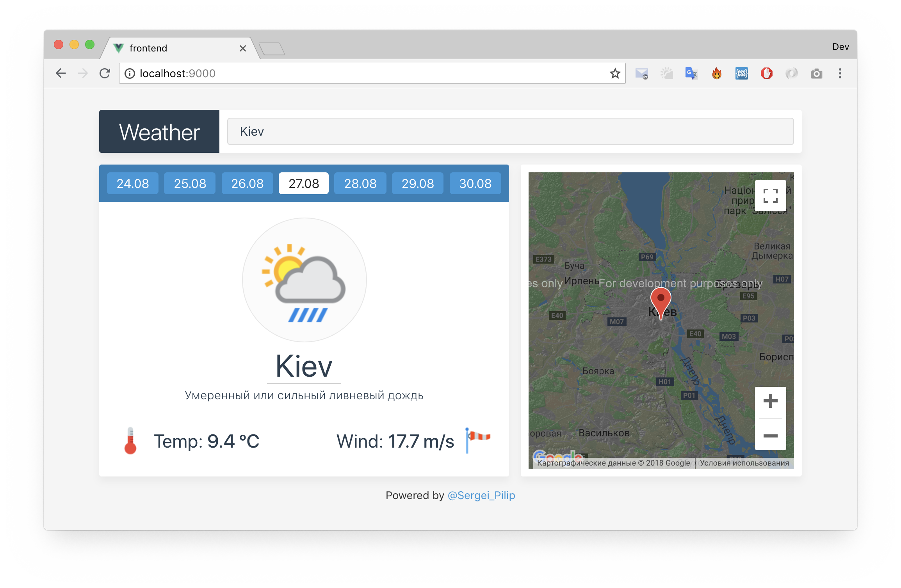

# LightIT - Practice - WeatherApp

In this practice, be both the frontend and the backend of the project.

This is a small application that can be developed into something bigger

Technologies:
- Backend: NodeJS, MongoDB, Mongoose
- Frontend: VueJS, SCSS



## Install:

For install full project write this in console:

```bash
git clone https://github.com/chrom007/lightit-practice.git
cd lightit-practice
npm install
cd frontend
npm install
```

## Preparing:

For compile frontend need enter next cmds:

```bash
cd frontend
npm run build
```

For prepare backend you must have installed mongodb, and running his on `27017` port or any other (check `config.js`).

## Running:

For run project server enter:

```bash
cd lightit-practice
npm run start
```

Server has running on [http://localhost:9000](http://localhost:9000).